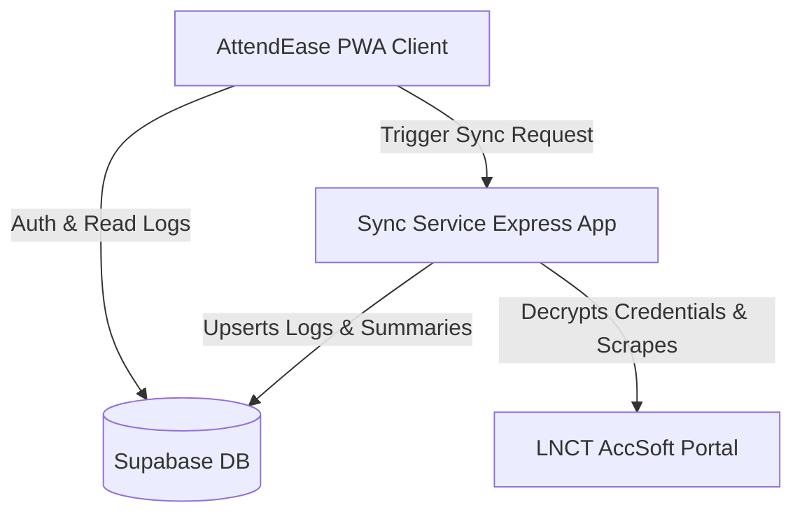

# AttendEase 📊
> LNCT Attendance Tracking Portal client app with day-wise logs, insights, and secure automated sync.

**AttendEase** is a modern, responsive Progressive Web App (PWA) designed to track, calculate, and analyze attendance for students of Lakshmi Narain College of Technology (LNCT) from their Accsoft portal. It acts as an elegant frontend dashboard using real-time data scraped securely from Accsoft and synced via a dedicated background service to a Supabase database.

---

## 🌟 Key Features
- **Modern Dashboard & Insights**: Dynamic charts, subject-wise attendance percentages, target attendance calculator (e.g., how many classes to attend to reach 75%), calendar-wise status tracker.
- **PWA Capabilities**: Offline access, custom app launch screen, installable on mobile and desktop platforms.
- **Secure Credentials Storage**: Accsoft login credentials are encrypted client-side/during sync setup using AES-256-GCM (with IV and Auth Tag) before storing in Supabase, keeping user credentials safe.
- **Automated Sync Worker**: Runs a standalone, lightweight Node.js scraper service (deployable on platforms like Railway) that logs into Accsoft, scrapes data, and upserts it to Supabase.
- **Real-Time Notifications & Toasts**: Informative feedback on sync completion, connection errors, and authentication state.
- **Supabase Backend**: Configured with Row Level Security (RLS) policies ensuring each student can view/edit *only* their own profile, connection details, and logs.

---

## 🏗️ Architecture & Flow



1. **User Authentication**: Student logs in / registers using Supabase Auth.
2. **Accsoft Integration**: Student connects their Accsoft credentials (Enrollment No. and Password) which are stored in encrypted format.
3. **Scraper / Sync Service**: A separate Node.js service receives a sync trigger, retrieves credentials from Supabase, decrypts them, performs programmatic login to the Accsoft portal, extracts attendance summaries and day-wise logs, and updates Supabase.
4. **Dashboard Update**: The frontend client listens or refreshes logs from Supabase and presents the parsed analytics to the user.

---

## 📂 Project Structure
- `index.html`: Main SPA application dashboard containing the HTML structure, onboarding steps, and visualizations.
- `styles.css`: Custom premium-styled dashboard CSS with a clean dark/light theme, modern gradients, layout responsive designs.
- `script.js`: Core client-side javascript logic for routing, session management, chart rendering, database interactions, encryption/decryption, and service worker handling.
- `manifest.json` & `service-worker.js`: PWA configuration for offline usability and install options.
- `supabase-migration.sql`: Database schema initialization script containing tables for `profiles`, `accsoft_connections`, `attendance_summary`, `attendance_logs`, RLS policies, and utility database triggers.
- [sync-service/](file:///Users/saurabh/Downloads/Attendease/sync-service): Express backend API responsible for logging into Accsoft using Cheerio/Axios, extracting logs, and syncing to Supabase.
- [accsoft-poc/](file:///Users/saurabh/Downloads/Attendease/accsoft-poc): A command-line proof of concept code verifying authentication scraper capabilities locally.

---

## 🚀 Setup & Local Running

### Prerequisites
- Node.js (v18 or above)
- A Supabase Project
- An Accsoft portal account (LNCT Student Portal)

### 1. Database Setup (Supabase)
1. Go to your [Supabase Dashboard](https://supabase.com) and create a new project.
2. Open the **SQL Editor** in Supabase and run the content of [supabase-migration.sql](file:///Users/saurabh/Downloads/Attendease/supabase-migration.sql).
3. Under authentication settings, configure signup options if needed.

### 2. Client Setup
1. In the root directory, locate [config.js](file:///Users/saurabh/Downloads/Attendease/config.js).
2. Configure your Supabase URL and anonymous key:
   ```javascript
   window.SUPABASE_URL = "YOUR_SUPABASE_PROJECT_URL";
   window.SUPABASE_ANON_KEY = "YOUR_SUPABASE_ANON_KEY";
   window.SYNC_SERVICE_URL = "http://localhost:3000"; // Point this to sync-service in local or production
   ```
3. Open `index.html` locally using any static web server (e.g. Live Server extension in VSCode, `npx serve`, or `python3 -m http.server`).

### 3. Sync Service Setup
1. Navigate to the sync service directory:
   ```bash
   cd sync-service
   ```
2. Install dependencies:
   ```bash
   npm install
   ```
3. Copy `.env.example` to `.env` and fill in the details:
   ```env
   PORT=3000
   SUPABASE_URL=YOUR_SUPABASE_PROJECT_URL
   SUPABASE_ANON_KEY=YOUR_SUPABASE_ANON_KEY
   ENCRYPTION_KEY=YOUR_32_BYTE_HEX_ENCRYPTION_KEY # (Must be exactly 64 characters long hex string)
   ```
4. Start the service:
   ```bash
   npm start
   ```

---

## 🛡️ Security & Privacy
- **Encryption**: Accsoft passwords are never stored in plain text. They are encrypted using `aes-256-gcm` (symmetric encryption) on Supabase.
- **Row-Level Security (RLS)**: Only the owner of the account can select, insert, or update their profile data, Accsoft connections, and logs.
- **User Token Delegation**: The sync service dynamically initializes a Supabase client using the Bearer token passed in the request header from the user. This ensures all database writes are performed strictly in the context of the authenticated user.

---

## 🛠️ Tech Stack
- **Frontend**: HTML5, Vanilla CSS3 (Custom Glassmorphic styles), ES6 Vanilla JavaScript, PWA Manifest + Service Worker.
- **Backend Service**: Node.js, Express, Axios, Axios Cookiejar Support, Tough Cookie, Cheerio.
- **Database**: PostgreSQL (Supabase), SQL Triggers, Pl/pgSQL.
